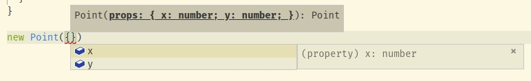
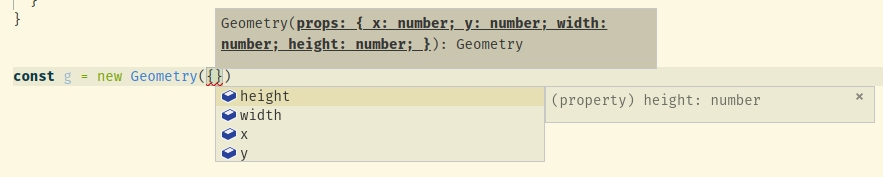
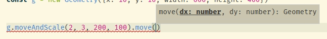

# @betafcc/dataclass

Small 'dataclass' utility that allows type-safe mixins

## install

```
npm i @betafcc/dataclass
```

## Usage

Define fields in `Dataclass<{...props}>` and extend it:

```ts
import {Dataclass} from '@betafcc/dataclass'

class Point extends Dataclass<{x: number, y: number}> { }
```

The constructor will be created for you:




More complete example, showing mixins and the `replace` and `pluck` utilities:

```ts
import {Dataclass, mixin, replace, pluck} from '@betafcc/dataclass'

class Point extends Dataclass<{x: number, y: number}> {
  // use the fake `this` parameter if you want to update
  // type info on subclasses
  move<A extends this>(this: A, dx: number, dy: number) {
    // pluck fields with `pluck`
    const [x, y] = pluck(this, ['x', 'y'])
    // pass the fields to update to `replace`
    return replace(this, {x: x + dx, y: y + dy})
  }
}


class Rectangle extends Dataclass<{width: number, height: number}> {
  scale<A extends this>(this: A, dw: number, dh: number) {
    // can pass a function to `replace`
    return replace(this, ({width, height}) => ({width: width + dw, height: height + dh}))
  }
}

// Apply previous classes as mixin, the result is a Dataclass itself,
// with the fields of the the base dataclasses merged and methods inherithed
class Geometry extends mixin(Point, Rectangle) {
  moveAndScale(dx: number, dy: number, dw: number, dh: number) {
    return this.move(dx, dy).scale(dw, dh)
  }
}

```

The type system will detect the new fields:



And inherited methods will know which class they belong now:


